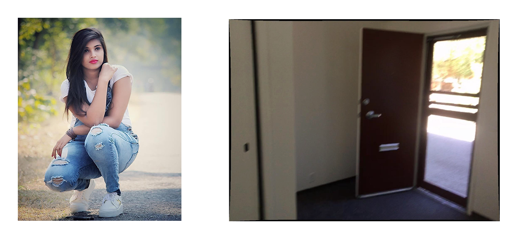
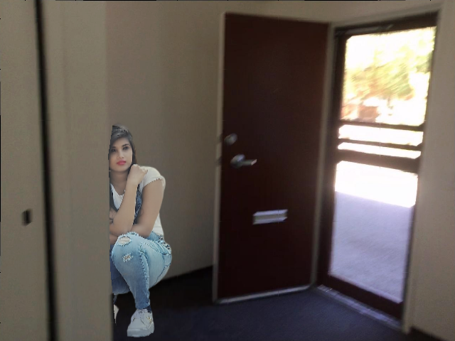
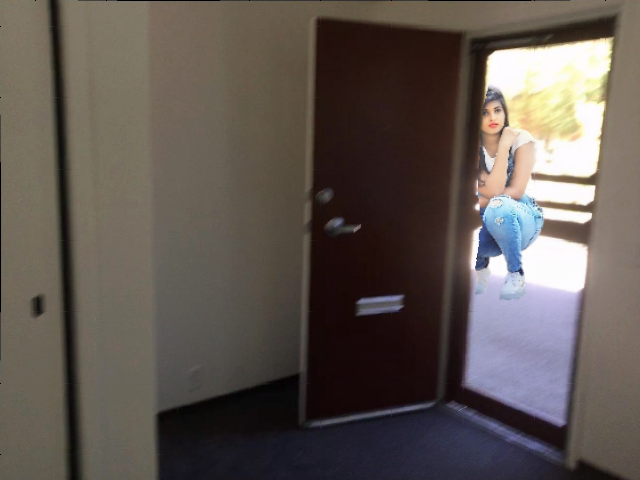
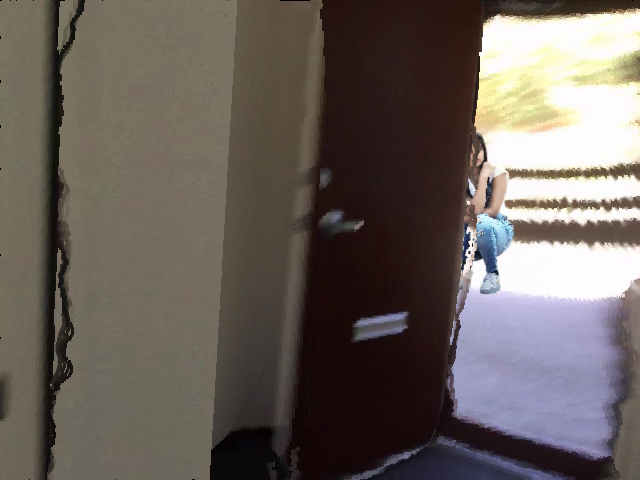

# Digital Human Teleportation

In this project, we can teleport a human into a 3D model in tree steps : 

1. We split a human portrait from a given image as the foreground by [U2Net](https://github.com/xuebinqin/U-2-Net) or [MODNet](https://github.com/ZHKKKe/MODNet).
2. We reconstruct a 3D model by a rgb indoor image by  [PlaneRCNN](https://github.com/NVlabs/planercnn), then transform and render the 3D model as the background.
3. We composite the foreground and background harmoniously to a image that satisfy the perspective relationship by [iDIH](https://github.com/saic-vul/image_harmonization).


We fork codes from [U2Net](https://github.com/xuebinqin/U-2-Net), [MODNet](https://github.com/ZHKKKe/MODNet), [PlaneRCNN](https://github.com/NVlabs/planercnn) and [iDIH](https://github.com/saic-vul/image_harmonization), then refactor them or add some codes into them. 

We add README.md file in each of them to show our modification and the usage, you can move into these folders to apply each part.


For example, we receive inputs as (including camera params): 



And the output images are like : 

> teleport human behind the wall



> teleport the human outside of the door



> change the camera position and view, then teleport the human (the unreasonable thick black lines comes from the low accuracy of 3D reconstruction in the details)




The folder are organized as following:

>// fork and refactor of projects
>
>U2Net_portrait/	:	our implement of U2Net for human matting
>
>MODNet/	:	the implement of MODNet for matting and our application for dataset synthesis
>
>planercnn/	:	the implement of PlaneRCNN and our application for generating 3D model and rendering
>
>iDIH/	:	the implement of iDIH
>
>
>
>// utils
>
>iharm/	:	the supplement codes from iDIH
>
>results/	:	the default input / output path of digital human teleportation task.
>
>
>
>//  steps
>
>pre_bg2ply.py	:	Step 2.0, generate 3D model by PlaneRCNN
>
>step1_matting.py	:	Step 1, by MODNet
>
>step2_ply2bg.py	:	Step 2, render 3D model to RGBD image
>
>step3_harmonization.py	:	Step 3, composite, then harmonization by iDIH
>
>
>
>// main : teleportation
>
>teleportation.py : step 1-3 for teleportation


### Environment

**pre_bg2ply.py** is an application of PlaneRCNN, which should compile and run with pytorch 0.4.0.

**teleportation** is implemented with pytorch 1.8.1. 

You can look into each part of the project to follow their requirements of environment.


### Usage

To quickly start the project, you should look into *MODNet/,  iDIH/, planercnn/* to download the models into default path (or download to your path, and indicate it in the parameters of the step_\* functions). 

**preparation of 3D model** : reconstruct the 3D model separately, because this step need different environment.

```base
python pre_bg2ply.py --methods=f --suffix=warping_refine --dataset=inference --customDataFolder=plancercnn/example_images
```

**teleportation** : 

```base
# before applying, you should adjust the settings items in teleportation.py
python teleportation.py
```


