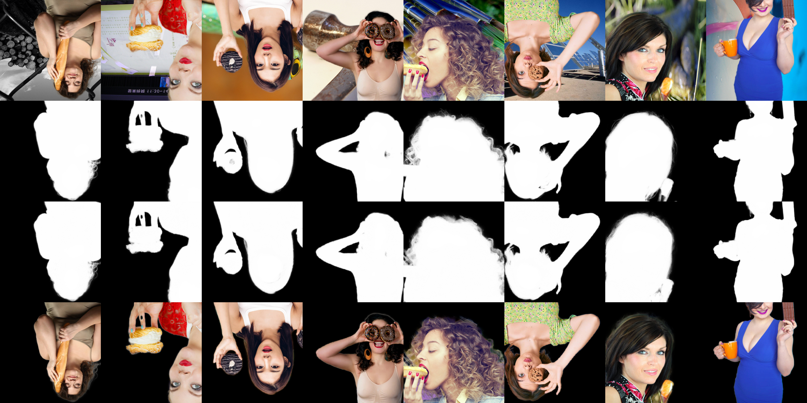

# U2Net implement for Human Matting

A fork of  for Human Matting task. 

We refactor the code for our implement, so the raw README.md is deleted.


## Contributions

1. **We create a synthetic dataset, paixin_comp_mod, for fine human matting (e.g. the masks have alpha value for details,  such as hair).** Raw images of human comes from [拍信](https://www.paixin.com/), and **3241** foreground is generated by [MODNet](https://github.com/ZHKKKe/MODNet). You can use [multi-level foreground estimation](https://arxiv.org/abs/2006.14970) and alpha compositing to create your datasets with any background images (by default, we choose 10000 images from ImageNet Validation). 
2. **We introduce a novel easy-to-hard training method for human matting task.** We denote backgrounds with solid color as "easy data", and those from real images as "hard data", and compositing them by alpha value. During train, we gradually enhance the alpha ratio  of the hard ones from 0 to 1, and the model can obtain better performance in this easy-to-hard training process. As a result, the L1 loss can be half of that without e2h training.


An example from datasets paixin_comp_mod : 


Result of easy-to-hard training : 




**However**, this dataset only consists of human with upper body instead of the whole body, so the model might won't work well for the whole human. What's more, we don't use the Refinement Network which is common in Image Matting tasks, so the result is not as good as the SOTA models. 


## Dataset Synthesis

We synthesize our datasets by MODNet, so the code is in *../MODNet/dataset_synthesis.py* . The code is easy to understand. 


## Usage


### environment

The same as the raw code from U2Net.


### datasets

You can download our **paixin_comp_mod** dataset from [Rec Pan](https://rec.ustc.edu.cn/share/ca041680-b641-11eb-9be8-57a7d47009bc),  and **aisegment** dataset from [Github](https://github.com/aisegmentcn/matting_human_datasets). You should change the setting files in *utils/load_settings/\*_settings.json* with item *dataset_path* to indicate your download path. 

- We don't provide background images in our paixin_comp_mod datasets, so you should prepare it by yourself.

- Note that the foreground folders and the background folders should have the same format as in *./data_examples* . 


### pretrained models

You can download our pretrained models from [Rec Pan](https://rec.ustc.edu.cn/share/2e04ce70-b640-11eb-a102-53f281482240).  You should change the setting files in *utils/load_settings/\*_settings.json* with item *pth_name* and *model_path* to indicate your download path.

- The logging of training is stored in folder *results_stage1* and *result_stage2*. 


### training

You can coarsely train your model with aisegment in stage1, and the result will be saved under *./results_stage1* :

```bash
# before training, you should adjust the settings in ./utils/load_settings/train_stage1_settings.json
python train_stage1.py
```

You can finely train your model with paixin_comp_mod by easy-to-hard method in stage2, and the result will be saved under *./results_stage2* : 

```bash
# before training, you should adjust the settings in ./utils/load_settings/train_stage2_settings.json
python train_stage2.py
```


### testing

You can test your model with paixin_comp_mod with any model : 

```bash
# before testing, you should adjust the settings in ./utils/load_settings/test_stage2_settings.json
python test_stage2.py
```

and the testing result will be saved under the same filter as the training result.


### apply

You can apply your trained model for any image : 

```bash
# before applying, you should adjust the settings items in apply.py
python apply.py
```


